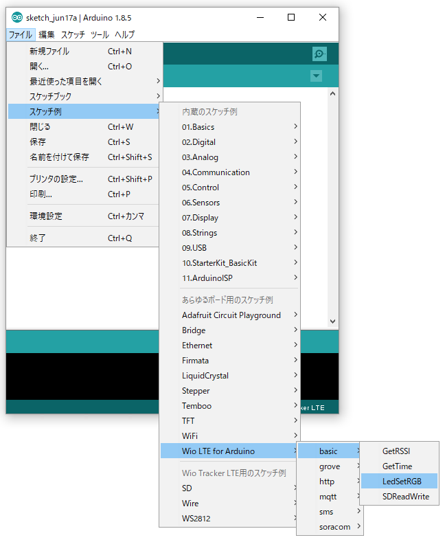
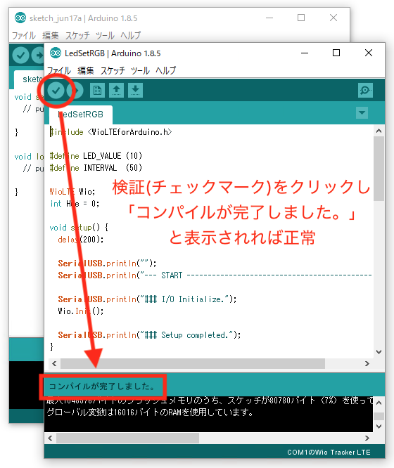

# 0. 事前準備

本章では、受講に先立って必要な開発環境のインストール作業について説明します。

詳細な手順は Windows / Mac それぞれの環境で異なりますが、おおまかに以下の作業が必要となります。

- 開発環境のインストール
  - Arduino IDE のインストール
  - WioLTE ボード定義のインストール
  - Arduino ライブラリのインストール
  - テストプログラムのビルド

ダウンロードするファイルサイズも大きいため、当日に行うとかなり時間がかかる可能性がありますので、必ず事前に済ませるようにして下さい。

## 開発環境のインストール
### インストール作業
以下のリンクから、開発環境のインストールを行って下さい。

- [→ 開発環境のインストール(Windows)](prepare-win)
- [→ 開発環境のインストール(Mac)](prepare-mac)

<h3 id="check">確認</h3>

インストールが終わったら、サンプルのプログラムをコンパイルしてみて、正しくインストールが出来たかを確認しましょう。

1. Arduino IDE で、ツール → ボード から、Seeed Wio LTE Cat.1 を選択

2. ファイル → スケッチ例 → Wio LTE for Arduino → basic → LedSetRGB を選択

3. ファイル のすぐ下にあるチェックアイコンをクリックし、しばらくして「コンパイルが完了しました。」と表示されれば、インストール状態は正常です。

> もしコンパイルに非常に長い時間がかかってしまう場合、PC のスペックが低い可能性があります。
> その場合時間内にハンズオンが完了出来ない可能性があるため、より性能の高い PC のご準備をご検討下さい。

## 以上で本章は終了です

達成状況を運営表へご記入ください。

* [目次ページへ戻る](../)
